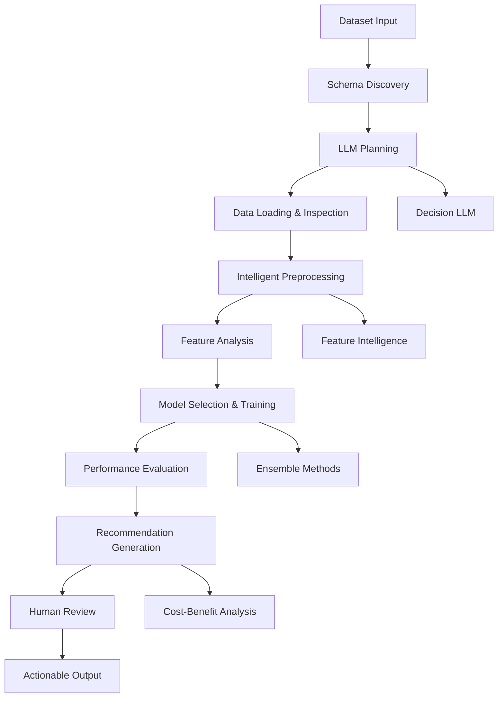
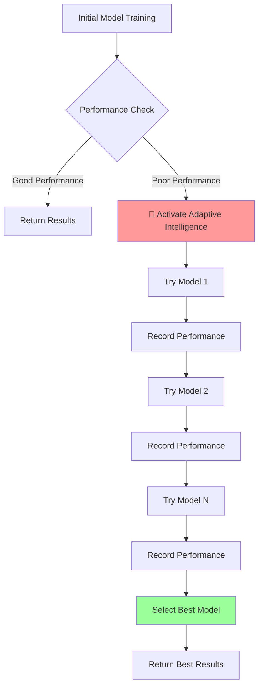

# Intelligent Multi-Agent System (MAS) for Smart Manufacturing

## Overview
This document describes an advanced hybrid agentic Multi-Agent System (MAS) designed for intelligent prescriptive maintenance in smart manufacturing. The system leverages Large Language Models (LLMs) and Small Language Models (SLMs) to create an intelligent, adaptive, and self-improving framework that can automatically analyze manufacturing data and generate actionable maintenance recommendations.

## Key Features

### 🧠 **Intelligent Decision Making**
- **LLM-Powered Orchestration**: Uses Google Gemini for high-level workflow planning and reasoning
- **Local LLM Integration**: Supports Qwen, Llama, and other local models for tactical decisions
- **Chain-of-Thought Reasoning**: Multi-step reasoning for complex decision making
- **Context-Aware Planning**: Adapts strategies based on data characteristics and performance

### 🔍 **Advanced Data Intelligence**
- **Automatic Schema Discovery**: Intelligently analyzes datasets to understand structure and relationships
- **Intelligent Feature Analysis**: Correlation analysis, feature importance, and redundancy detection
- **Data Leakage Prevention**: Ensures target variables are properly isolated from features
- **Domain-Aware Preprocessing**: Manufacturing-specific data cleaning and feature engineering

### 🎯 **Multi-Modal Problem Solving**
- **Classification**: Maintenance priority prediction, failure classification
- **Regression**: Cost prediction, performance estimation
- **Anomaly Detection**: Unusual pattern identification in sensor data
- **Multi-Objective Optimization**: Balancing multiple maintenance objectives

### 🔄 **Adaptive Workflow**
- **Dynamic Tool Selection**: Chooses appropriate models and preprocessing strategies
- **Performance-Based Adaptation**: Learns from results to improve future decisions
- **Error Recovery**: Intelligent fallback strategies when approaches fail
- **Human-in-the-Loop**: Optional human oversight and approval for critical decisions
- **Adaptive Intelligence**: Automatically tries multiple models when performance is poor
- **Model Diversity**: Tests different algorithms to find the best fit for each dataset

## Architecture Layers

### 1. **Intelligence Layer** 🧠
- **LLM Planner Agent**: High-level workflow orchestration using Google Gemini
- **Decision LLM Agent**: Tactical decisions using local models (Qwen, Llama, etc.)
- **Schema Discovery System**: Automatic dataset understanding and preprocessing suggestions
- **Tool Decider**: Intelligent selection of preprocessing and modeling tools

### 2. **Perception Layer** 👁️
- **Data Loader Agent**: Loads and inspects datasets with comprehensive metadata
- **Data Quality Assessor**: Identifies missing values, outliers, and data quality issues
- **Feature Type Detector**: Automatically classifies numerical, categorical, and temporal features

### 3. **Preprocessing Layer** 🔧
- **Intelligent Preprocessing Agent**: Advanced data cleaning and feature engineering
- **Feature Analysis Engine**: Correlation analysis, importance ranking, redundancy detection
- **Encoding Strategy Selector**: Intelligent categorical encoding and scaling strategies
- **Data Leakage Prevention**: Ensures proper separation of features and targets

### 4. **Analysis Layer** 📊
- **Dynamic Analysis Agent**: Multi-model approach with intelligent model selection
- **Performance Evaluator**: Comprehensive model evaluation with multiple metrics
- **Ensemble Orchestrator**: Combines multiple models for improved performance
- **Anomaly Detection Engine**: Specialized tools for identifying unusual patterns

### 5. **Optimization Layer** 🎯
- **Prescriptive Optimization Agent**: Generates actionable maintenance recommendations
- **Cost-Benefit Analyzer**: Evaluates maintenance actions based on cost and impact
- **Priority Ranking Engine**: Ranks recommendations by urgency and importance
- **Resource Allocation Optimizer**: Optimizes maintenance scheduling and resource usage

### 6. **Interface Layer** 🖥️
- **Human-in-the-Loop Interface**: CLI and web interfaces for human oversight
- **Audit Logging System**: Comprehensive logging of all decisions and actions
- **Batch Processing Engine**: Processes multiple datasets automatically
- **Interactive Setup**: Guided setup for custom datasets and configurations

## Data Flow



## Supported Datasets

### **Smart Manufacturing Maintenance Dataset**
- **Size**: 1,430 records, 10 features
- **Features**: Machine_ID, Temperature, Vibration, Pressure, Acoustic, Inspection Duration, Downtime Cost, Technician Availability, Failure Probability, Maintenance Priority
- **Use Cases**: Predictive maintenance, cost optimization, resource allocation

### **Intelligent Manufacturing Dataset (6G)**
- **Size**: 100,000+ records, multiple features
- **Features**: Advanced sensor data, IoT metrics, manufacturing parameters
- **Use Cases**: Large-scale anomaly detection, performance optimization, quality control

## Usage Modes

### **Auto Mode** (`--auto`)
- Fully automated workflow with minimal human intervention
- Uses schema discovery for automatic setup
- Ideal for batch processing and production environments

### **Interactive Mode** (default)
- Guided setup with human oversight
- Step-by-step decision making with explanations
- Perfect for exploration and learning

### **Batch Mode** (`--batch`)
- Processes all datasets in the data directory
- Automated comparison across multiple datasets
- Ideal for comprehensive analysis and benchmarking

## LLM Integration

### **Planner LLM** (Google Gemini)
- High-level workflow orchestration
- Complex reasoning and planning
- Human-in-the-loop interactions
- Error recovery and adaptation

### **Decision LLM** (Local Models)
- Tactical preprocessing decisions
- Model selection and hyperparameter tuning
- Feature engineering recommendations
- Performance optimization

## Performance Features

### **Intelligent Feature Analysis**
- Automatic correlation analysis
- Feature importance ranking
- Redundancy detection and removal
- High-cardinality categorical handling

### **Multi-Model Approach**
- Automatic model selection based on data characteristics
- Ensemble methods for improved performance
- Cross-validation and robust evaluation
- Performance-based model switching

### **Data Quality Assurance**
- Comprehensive data validation
- Missing value analysis and imputation
- Outlier detection and handling
- Data leakage prevention

## 🧠 Adaptive Intelligence System

### **Overview**
The Adaptive Intelligence System is a core component that automatically detects poor model performance and intelligently switches to alternative models to achieve better results. This system operates transparently and requires no manual intervention.

### **Activation Triggers**

#### **1. Performance Threshold Detection**
The system monitors model performance and activates adaptive intelligence when:

**For Regression Tasks:**
- R² Score < 0.1 (10% variance explained)
- Indicates the model performs worse than a simple baseline

**For Classification Tasks:**
- Accuracy < 0.6 (60% correct predictions)
- Indicates poor classification performance

**For Anomaly Detection:**
- No automatic activation (performance metrics vary by use case)

#### **2. Automatic Model Switching**
When poor performance is detected, the system automatically:

1. **Logs the Detection**: `🧠 Poor performance detected! Trying adaptive intelligence with multiple models...`
2. **Tries Multiple Models**: Tests different algorithms systematically
3. **Tracks Performance**: Records performance of each model tried
4. **Selects Best Model**: Returns the highest performing model
5. **Reports Results**: Logs the best model and its performance

### **Model Diversity Strategy**

#### **Regression Models (in order of testing):**
1. **RandomForestRegressor**: Robust ensemble method
2. **LinearRegression**: Simple linear relationship modeling
3. **Ridge**: Regularized linear regression
4. **Lasso**: Feature selection with regularization
5. **SVR**: Support Vector Regression for non-linear patterns

#### **Classification Models (in order of testing):**
1. **RandomForestClassifier**: Robust ensemble method
2. **LogisticRegression**: Linear classification with regularization
3. **SVC**: Support Vector Classification for complex boundaries

### **Adaptive Intelligence Workflow**



### **Performance Tracking**

The system maintains detailed tracking:

- **Tried Models**: List of models already attempted
- **Best Performance**: Highest performance score achieved
- **Best Model**: Name of the best performing model
- **Best Results**: Complete results from the best model

### **Logging and Transparency**

#### **Activation Logs:**
```
[INFO] - 🧠 Poor performance detected! Trying adaptive intelligence with multiple models...
[INFO] - 🧠 ADAPTIVE INTELLIGENCE: Trying multiple models for better performance...
[INFO] - 🔄 Trying RandomForestRegressor...
[INFO] -    RandomForestRegressor performance: 0.2341
[INFO] - 🔄 Trying LinearRegression...
[INFO] -    LinearRegression performance: 0.4567
[INFO] - 🔄 Trying Ridge...
[INFO] -    Ridge performance: 0.5234
[INFO] - 🏆 Best model: Ridge (performance: 0.5234)
```

#### **LLM Awareness:**
The LLM is informed about adaptive intelligence capabilities:
- **Prompt Enhancement**: "ADAPTIVE INTELLIGENCE: The system will automatically try multiple models if performance is poor"
- **Context Awareness**: LLM understands when adaptive intelligence is active
- **Performance Expectations**: LLM knows to expect model switching for poor performance

### **Benefits**

1. **Automatic Optimization**: No manual model selection required
2. **Better Performance**: System finds the best model for each dataset
3. **Transparent Process**: Clear logging of all model attempts
4. **Intelligent Fallback**: Graceful handling of poor initial performance
5. **Learning Capability**: System builds knowledge of what works for different data types

### **Error Handling**

- **Model Failures**: If a model fails, it's logged and the next model is tried
- **All Models Fail**: If all models fail, the system returns the original results with error logging
- **Memory Management**: Tracks tried models to avoid infinite loops
- **Performance Validation**: Ensures performance metrics are valid before comparison

## Future Enhancements

### **Phase 1: Enhanced Reasoning** (Current Focus)
- Chain-of-thought reasoning for complex decisions
- Context-aware planning with memory
- Intelligent error recovery strategies

### **Phase 2: Adaptive Intelligence**
- Dynamic workflow adaptation based on performance
- Multi-model orchestration with intelligent selection
- Advanced data understanding with domain knowledge

### **Phase 3: Learning System**
- Self-improving capabilities through experience
- Domain-specific manufacturing intelligence
- Predictive performance and proactive optimization

---

*This documentation reflects the current state of the intelligent MAS framework as of 2024. The system continues to evolve with enhanced reasoning capabilities and adaptive intelligence features.*
